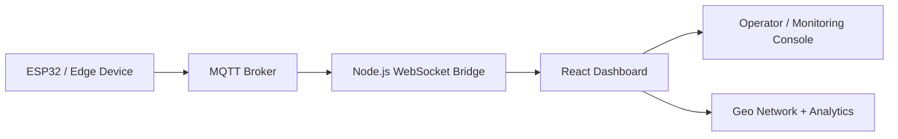

# SafeNetQ-Core

<p align="center">
  
  
</p>

<p align="center">
  
  
  
  
  
  
</p>

<p align="center">
  <b>Real-time fault detection and monitoring for modern power distribution systems</b>
</p>

SafeNetQ-Core is an IoT-driven smart-grid protection system focused on detecting high-impedance faults (HIF) in electrical networks. The project combines live telemetry, cloud-connected MQTT messaging, and an operator dashboard to monitor device health, fault status, and power-line conditions in real time.

## Overview

SafeNetQ monitors parameters such as voltage, current, THD, peak current, and fault state across distributed feeder nodes. It provides a command-center dashboard where operators can:

- visualize device health across a live geographic network
- inspect analog-style electrical metrics
- identify fault conditions instantly
- add or remove devices from the managed network
- stream telemetry from IoT devices through a resilient broker pipeline

## System Architecture



## Current Implementation Status

### Implemented

- Frontend dashboard for power-system monitoring
- Geographic network view for simulated grid locations
- Device health and operational status panels
- Simulated voltage/current telemetry generation
- Fault-state highlighting for operator visibility
- Node management tools for adding and removing devices
- MQTT/WebSocket middleware prototype for telemetry streaming
- JSON contract for telemetry and system payload structure
- Local project setup and GitHub-ready documentation

### In Progress / Pending

- ESP32 hardware integration and sensing layer
- Real AC signal acquisition and calibration
- Voltage and current measurement validation on hardware
- High-impedance fault detection logic using waveform features
- Relay trip and fail-safe protection logic
- Reclose and lockout sequence logic
- GSM backup alert path and communication layer
- Secure cloud deployment setup for MQTT and dashboard services
- Machine-learning model training and threshold tuning
- End-to-end product validation on physical line hardware

### Product Positioning

This repository currently represents the frontend and telemetry-prototype layer of the SafeNetQ product vision. The actual embedded hardware protection system, relay-based fault handling, and real-world power protection logic are still under active development and are not yet fully integrated into this codebase.

## Tech Stack

| Layer | Technology |
|---|---|
| Frontend | React, Chart.js, Leaflet |
| Backend | Node.js |
| Messaging | MQTT, WebSocket |
| Data Model | JSON telemetry payloads |
| Monitoring | Real-time status dashboards |

## Project Structure

```text
SafeNetQ-Core/
├── frontend/              # React dashboard application
│   ├── public/
│   └── src/
├── server.js              # MQTT + WebSocket bridge
├── api-contract.json      # Telemetry and inference schema
├── .env                   # Local environment variables
├── package.json           # Backend dependencies
├── README.md              # Project documentation
└── .gitignore
```

## Prerequisites

Before running the project locally, make sure you have:

- Node.js 18+
- npm
- Git

## Local Setup

### 1) Clone the repository

```bash
git clone https://github.com/techie-hrushik027/SafeNetQ-Core.git
cd SafeNetQ-Core
```

### 2) Install backend dependencies

```bash
npm install
```

### 3) Configure environment variables

Create a `.env` file in the project root:

```env
MQTT_BROKER_URL=mqtt://test.mosquitto.org
MQTT_TOPIC=safenetq/telemetry
MQTT_USERNAME=
MQTT_PASSWORD=
WS_PORT=8080
```

If using a private broker, replace with your actual credentials:

```env
MQTT_BROKER_URL=mqtts://your-hivemq-host:8883
MQTT_TOPIC=safenetq/telemetry
MQTT_USERNAME=your-username
MQTT_PASSWORD=your-password
WS_PORT=8080
```

### 4) Start the middleware server

```bash
node server.js
```

### 5) Start the frontend

```bash
cd frontend
npm install
npm start
```

Open the app at:

```text
http://localhost:3000
```

## Implemented vs Pending

### Implemented

- React-based monitoring dashboard
- Simulated electrical telemetry model
- Geo-visualization of distributed nodes
- Device management UI
- MQTT/WebSocket data stream prototype
- Dashboard documentation and startup flow

### Pending

- ESP32 hardware integration
- Real AC sensing and calibration
- Embedded signal processing for electrical faults
- HIF classification model and thresholds
- Relay-driven protection logic
- Reclose and lockout sequence implementation
- GSM alert channel
- Cloud deployment pipeline with secure configuration
- End-to-end field validation

## Product Positioning

This project is currently a frontend-first prototype and monitoring interface for the SafeNetQ product vision. It demonstrates the monitoring and visualization layer, but the actual hardware-based protection system is still in progress and has not yet been fully integrated into the repository.

## Use Cases

- Smart-substation monitoring
- Feeder line fault detection
- Power distribution visualization
- Industrial IoT dashboarding for utilities
- Edge AI and predictive maintenance workflows

## Resume-Friendly Project Summary

SafeNetQ-Core is an ongoing smart-grid monitoring and fault-detection project focused on building a real-time protection dashboard for electrical infrastructure. The current codebase demonstrates a frontend monitoring interface and simulated telemetry architecture, while the embedded hardware sensing, fault-classification logic, and relay-based protection layer remain under active development. The project is positioned as a prototype industrial IoT solution for power protection and grid monitoring, with hardware integration and real protection logic planned as the next major milestones.

## Roadmap

1. Hardware integration with ESP32 edge devices
2. Machine learning model for HIF classification
3. Relay automation and trip logic
4. Historical logs and analytics database
5. Secure industrial deployment and cloud monitoring

## Roles
Hrushikesh Kapre - Planning, pipelining and integration
Mitali Agrawal - Backend
Raghav Singh - Frontend
Aarushi Tyagi - Research, Hardware design and integration

## License

This project is licensed under the MIT License. See the [LICENSE](LICENSE) file for details.

---

<p align="center">
  <i>Built for resilient, intelligent, and real-time power infrastructure monitoring.</i>
</p>

