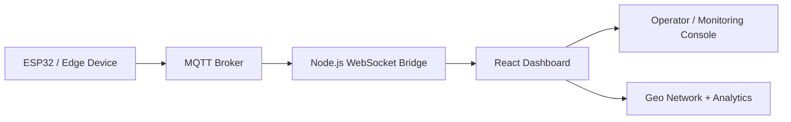

# SafeNetQ-Core

<p align="center">
  
  
</p>

<p align="center">
  
  
  
  
  
  
</p>

<p align="center">
  <b>Real-time fault detection and monitoring for modern power distribution systems</b>
</p>

SafeNetQ-Core is an IoT-driven smart-grid protection system focused on detecting high-impedance faults (HIF) in electrical networks. The project combines live telemetry, cloud-connected MQTT messaging, and an operator dashboard to monitor device health, fault status, and power-line conditions in real time.

## Overview

SafeNetQ monitors parameters such as voltage, current, THD, peak current, and fault state across distributed feeder nodes. It provides a command-center dashboard where operators can:

- visualize device health across a live geographic network
- inspect analog-style electrical metrics
- identify fault conditions instantly
- add or remove devices from the managed network
- stream telemetry from IoT devices through a resilient broker pipeline

## System Architecture



## Current Implementation Status

### Completed

- Live dashboard interface for power-system monitoring
- Device cards and status panels for grid nodes
- Geographic map view for feeder and substation simulated locations
- Real-time simulated telemetry for voltage and current
- Fault detection highlighting with red/green operational state
- Node management features to add and remove devices
- MQTT/WebSocket middleware for streaming telemetry
- JSON telemetry contract for payload structure and fault state expectations

### In Progress / Planned

- ESP32 hardware integration and live field data acquisition
- Real machine-learning-based fault classification
- Automated relay trip logic and interlock handling
- Persistent database storage for historical events
- Authentication and role-based access control
- Cloud deployment and remote observability

## Tech Stack

| Layer | Technology |
|---|---|
| Frontend | React, Chart.js, Leaflet |
| Backend | Node.js |
| Messaging | MQTT, WebSocket |
| Data Model | JSON telemetry payloads |
| Monitoring | Real-time status dashboards |

## Project Structure

```text
SafeNetQ-Core/
├── frontend/              # React dashboard application
│   ├── public/
│   └── src/
├── server.js              # MQTT + WebSocket bridge
├── api-contract.json      # Telemetry and inference schema
├── .env                   # Local environment variables
├── package.json           # Backend dependencies
├── README.md              # Project documentation
└── .gitignore
```

## Prerequisites

Before running the project locally, make sure you have:

- Node.js 18+
- npm
- Git

## Local Setup

### 1) Clone the repository

```bash
git clone https://github.com/techie-hrushik027/SafeNetQ-Core.git
cd SafeNetQ-Core
```

### 2) Install backend dependencies

```bash
npm install
```

### 3) Configure environment variables

Create a `.env` file in the project root:

```env
MQTT_BROKER_URL=mqtt://test.mosquitto.org
MQTT_TOPIC=safenetq/telemetry
MQTT_USERNAME=
MQTT_PASSWORD=
WS_PORT=8080
```

If using a private broker, replace with your actual credentials:

```env
MQTT_BROKER_URL=mqtts://your-hivemq-host:8883
MQTT_TOPIC=safenetq/telemetry
MQTT_USERNAME=your-username
MQTT_PASSWORD=your-password
WS_PORT=8080
```

### 4) Start the middleware server

```bash
node server.js
```

### 5) Start the frontend

```bash
cd frontend
npm install
npm start
```

Open the app at:

```text
http://localhost:3000
```

## Use Cases

- Smart-substation monitoring
- Feeder line fault detection
- Power distribution visualization
- Industrial IoT dashboarding for utilities
- Edge AI and predictive maintenance workflows

## Resume-Friendly Project Summary

SafeNetQ-Core is a power-grid monitoring and fault-detection project built around a live operator dashboard for electrical infrastructure. It simulates distributed line nodes, visualizes voltage/current behavior, highlights fault conditions, and provides a Node.js MQTT/WebSocket bridge for real-time telemetry streaming. The project demonstrates a practical smart-grid monitoring workflow suitable for IoT-based power protection systems, utilities, and energy analytics applications.

## Roadmap

1. Hardware integration with ESP32 edge devices
2. Machine learning model for HIF classification
3. Relay automation and trip logic
4. Historical logs and analytics database
5. Secure industrial deployment and cloud monitoring

## License

This repository is currently intended for educational, prototype, and research-oriented development.

---

<p align="center">
  <i>Built for resilient, intelligent, and real-time power infrastructure monitoring.</i>
</p>

